<div align="center">


<br>

**Drive AI agents through the full offensive-security lifecycle — from a single web console, a chat message, or your favorite AI coding tool.**

<p>
  <a href="https://go.dev/dl/"></a>
  <a href="LICENSE"></a>
  
  
  <br>
  
  
  
  
  
</p>

<a href="#quick-start"><b>Quick start</b></a> ·
<a href="#architecture"><b>Architecture</b></a> ·
<a href="#configuration"><b>Configure</b></a> ·
<a href="#integrations"><b>Integrations</b></a> ·
<a href="#usage"><b>Usage</b></a>

</div>

---

**Pyntra** is an AI-native penetration-testing platform. It orchestrates **111 security tools** over the [Model Context Protocol (MCP)](https://modelcontextprotocol.io), reasons about findings, builds **attack chains**, retrieves from a **security knowledge base**, and keeps every step auditable. You describe the objective in plain language; the agent plans, runs tools, correlates results, and reports back.

It runs **fully offline** against a local model, connects to **any inference provider** (Ollama, OpenAI, Anthropic, Hugging Face, and more), integrates **Burp Suite** over MCP, and can itself be consumed as an MCP server by **Claude Code, Cursor, Cline, opencode, Codex, and Windsurf**.

> [!WARNING]
> **Authorized use only.** Pyntra is for penetration testing and security research on systems you **own or are explicitly authorized to test**. You are responsible for complying with all applicable laws and rules of engagement.

<details>
<summary><b>Table of contents</b></summary>

- [Highlights](#highlights)
- [How it works](#how-it-works)
- [Screenshots](#screenshots)
- [Quick start](#quick-start)
- [Architecture](#architecture)
  - [System overview](#system-overview)
  - [Agent execution loop](#agent-execution-loop)
  - [Multi-agent orchestration](#multi-agent-orchestration)
  - [MCP integration model](#mcp-integration-model)
- [Configuration](#configuration)
- [Integrations](#integrations)
  - [Inference providers](#inference-providers)
  - [Burp Suite over MCP](#burp-suite-over-mcp)
  - [Pyntra as an MCP server](#pyntra-as-an-mcp-server)
  - [Recon API keys](#recon-api-keys-shodan--censys)
  - [Chat bots](#chat-bots-telegram--slack--discord)
- [Usage](#usage)
- [Tool catalog](#tool-catalog)
- [Project structure](#project-structure)
- [Tech stack](#tech-stack)
- [Roadmap](#roadmap)
- [Contributing](#contributing)
- [License](#license)

</details>

## Highlights

| Feature | What it does |
|---|---|
| **AI orchestration** | Single-agent (ReAct) and multi-agent modes — **Deep**, **Plan-Execute**, and **Supervisor** — that plan, act, and self-correct. |
| **Native MCP, both ways** | A built-in MCP server, first-class **external MCP servers** (incl. **Burp Suite**), and Pyntra usable *as* an MCP server from AI coding tools. |
| **Any model, any provider** | 13 provider presets — **Ollama / local**, OpenAI, Anthropic Claude, Hugging Face, DeepSeek, OpenRouter, Groq, Together, Mistral, LM Studio, vLLM, LocalAI, or any custom OpenAI-compatible endpoint. |
| **Role-based testing** | 13 predefined security roles with scoped prompts and restricted tool access (recon, web, cloud, CTF, forensics…). |
| **Skills system** | 23 modular skill packages for domains like SQLi, XSS, SSRF, IDOR, and API security. |
| **Knowledge base (RAG)** | Vector retrieval over your own security knowledge, with local-embedding support. |
| **Attack-chain graphing** | Visualize, score, and replay multi-step testing sequences. |
| **Vuln & WebShell management** | Track findings and manage remote sessions from the console. |
| **Chat access** | Optional **Telegram**, **Slack**, and **Discord** bots — test on the go, keep per-chat context. |
| **Enterprise web console** | Token-based design system, light and dark themes, keyboard-accessible, all assets served locally. |

## How it works

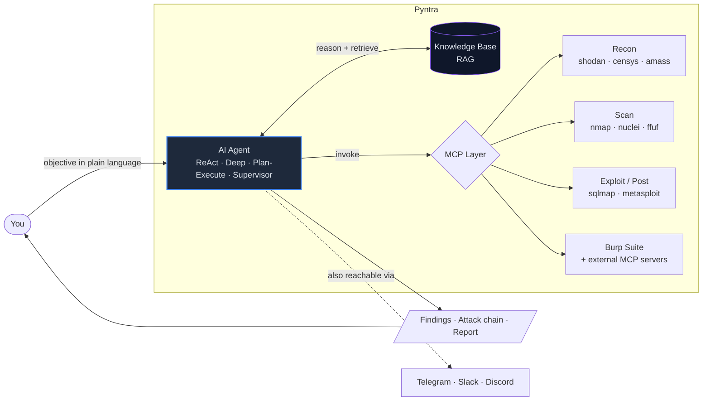

## Screenshots

| Dashboard (dark) | Dashboard (light) |
|---|---|
| 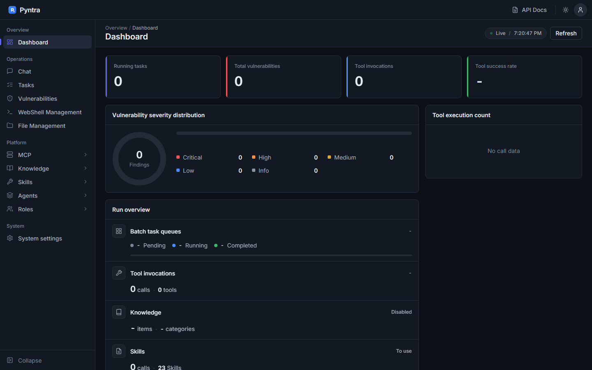 | 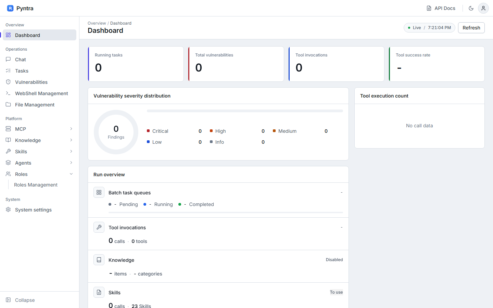 |
| **Chat console** | **Findings** |
| 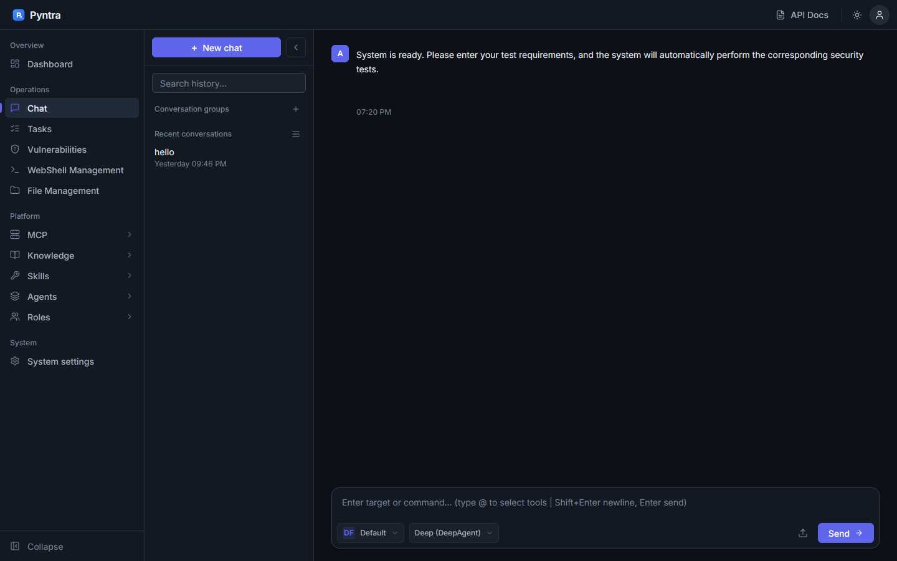 | 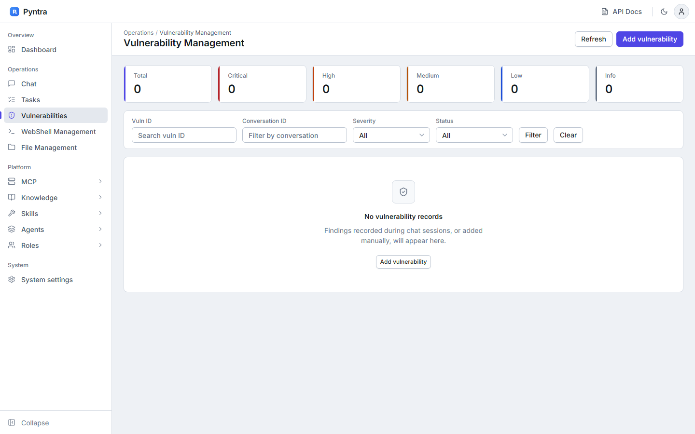 |
| **MCP management** | **Role management** |
| 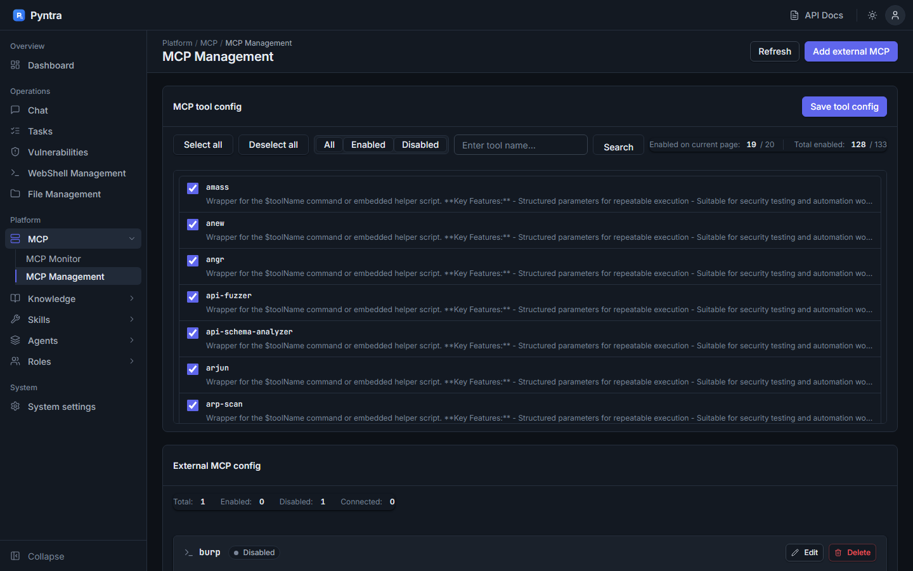 | 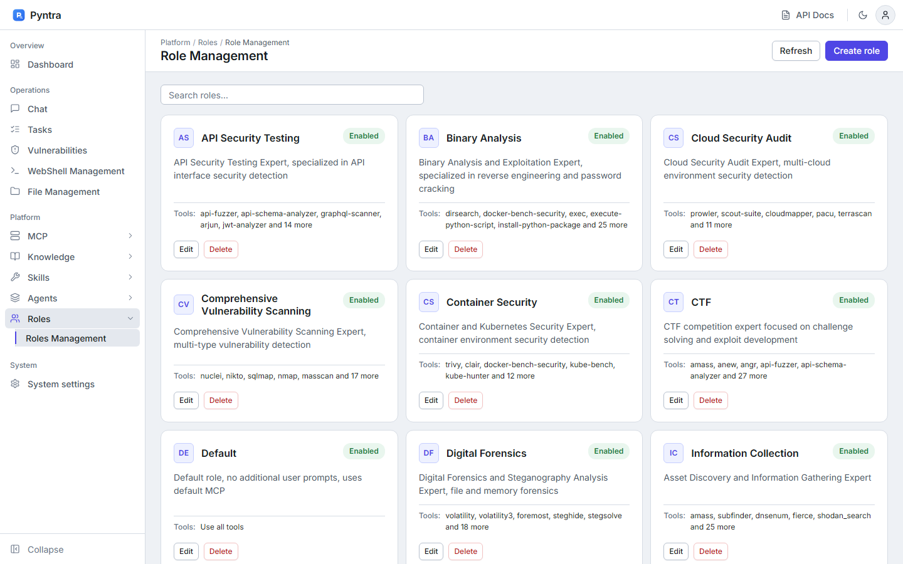 |
| **Skills** | |
| 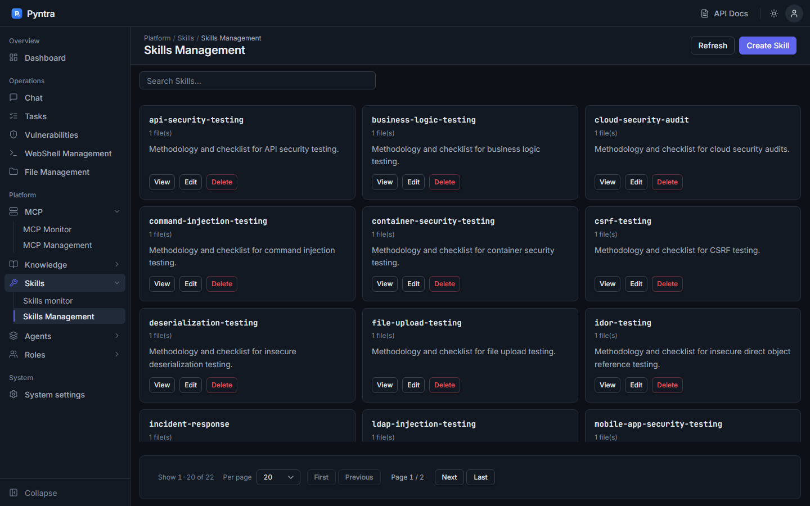 | |

## Quick start

### Prerequisites

| Requirement | Notes |
|---|---|
| **[Go 1.25+](https://go.dev/dl/)** | To build the server. |
| **An LLM endpoint** | A local **[Ollama](https://ollama.com)** install (recommended, fully offline), or any OpenAI-compatible / Claude / HF endpoint. |
| **Python 3** *(optional)* | Only for a few Python-based tools (e.g. `shodan_search`, `censys_search`). |
| **Security CLIs** *(optional)* | `nmap`, `nuclei`, `ffuf`, `amass`, … — install the ones you plan to use; the agent uses whatever is on `PATH`. |

```bash
# 1 — Clone
git clone https://github.com/prnvv2/pyntra.git
cd pyntra

# 2 — Start a local model (recommended, fully offline)
ollama pull llama3.1:8b          # from https://ollama.com
#     then set openai.model: llama3.1:8b in config.yaml (base_url already points at Ollama)

# 3 — Build & run
go build -o pyntra ./cmd/server
./pyntra                          # Windows: .\pyntra.exe
```

Open the console at **http://localhost:8080** and log in with the password from `config.yaml`.

> [!IMPORTANT]
> **Change the default password (`Root@1234`) before exposing Pyntra to any network.** Edit `auth.password` in `config.yaml` or update it from the **Settings** page. See **[OLLAMA_QUICKSTART.md](OLLAMA_QUICKSTART.md)** for the full offline walkthrough.

## Architecture

### System overview

A layered Go service: a Gin HTTP/WebSocket API fronts the agent orchestration core, which reasons with the LLM, grounds itself with roles/skills/RAG, and acts through the MCP layer onto 111 tools and external MCP servers. All state persists in SQLite.

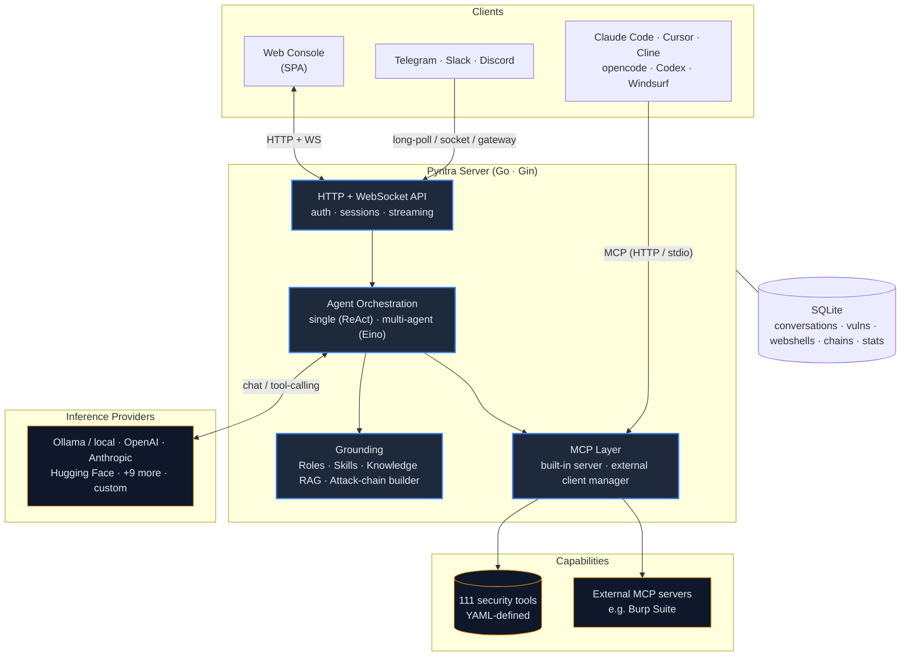

### Agent execution loop

The single-agent path is a streaming **ReAct** loop: reason → call tools over MCP → observe → repeat, until the objective is met or the iteration budget is reached, at which point it summarizes.

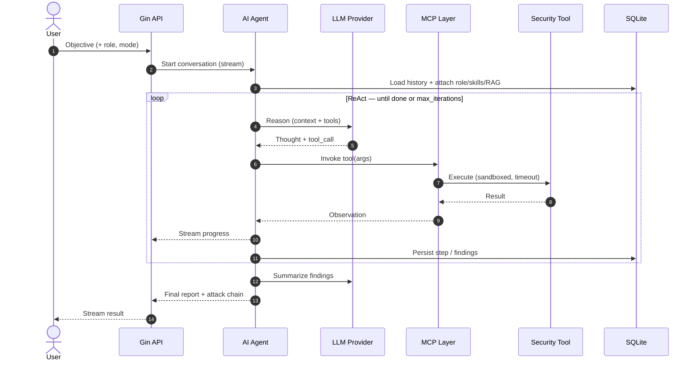

### Multi-agent orchestration

For larger objectives, Pyntra decomposes work across specialized sub-agents (powered by CloudWeGo **Eino**). Pick the strategy per conversation:

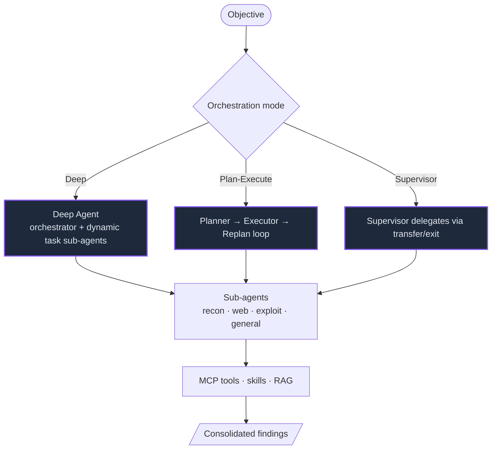

| Mode | Best for | How it works |
|---|---|---|
| **Deep** | Open-ended objectives | An orchestrator spawns task sub-agents on the fly and integrates their results. |
| **Plan-Execute** | Well-defined multi-step goals | Plans upfront, executes step by step, and replans when reality diverges. |
| **Supervisor** | Coordinating specialists | A supervisor routes work to named sub-agents and decides when to stop. |

### MCP integration model

MCP flows in **both directions**. Pyntra hosts a built-in MCP server *and* connects out to external MCP servers; AI coding tools can connect *in* to consume Pyntra's tools.

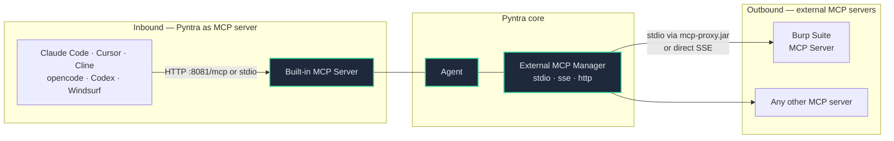

**Stack at a glance:** Go · Gin · Gorilla WebSocket · CloudWeGo Eino · Model Context Protocol · modernc SQLite · Zap · discordgo.

## Configuration

Everything lives in [`config.yaml`](config.yaml) and most of it is editable from the **Settings** page in the web console.

| Section | Controls |
|---|---|
| `server` | Listen host and port. Defaults to `127.0.0.1:8080` (loopback only); set `0.0.0.0` to expose it on a network, after changing the password. |
| `auth` | Web login password and session length — **change `Root@1234`**. |
| `openai` | LLM `provider`, `base_url`, `api_key`, `model` — see [Inference providers](#inference-providers). |
| `agent` | Max ReAct iterations, tool timeouts, large-result handling. |
| `multi_agent` | Enable multi-agent mode, default orchestration, Eino middleware. |
| `knowledge` | Embedding model and RAG retrieval settings. |
| `mcp` | Built-in MCP server (default `:8081`) and auth header. |
| `external_mcp` | External MCP tool servers (incl. the `burp` preset). |
| `bots` | Telegram / Slack / Discord chat bots. |
| `roles_dir` · `skills_dir` · `tools_dir` · `agents_dir` | Where roles, skills, tools, and sub-agents are loaded from. |

## Integrations

### Inference providers

Pyntra speaks the **OpenAI Chat Completions** protocol for every provider except Anthropic (which is auto-bridged to the Messages API). Any OpenAI-compatible endpoint therefore works — it's fully custom-configurable. `GET /api/config/providers` returns the live catalogue; full reference in **[docs/providers.md](docs/providers.md)**.

| Provider id | Base URL | Notes |
|---|---|---|
| `ollama` | `http://localhost:11434/v1` | **Local, offline.** Any Ollama model; `api_key` can be any placeholder. |
| `openai` | `https://api.openai.com/v1` | Official OpenAI. |
| `anthropic` *(alias `claude`)* | `https://api.anthropic.com/v1` | Auto-bridged to the Messages API. |
| `huggingface` *(alias `hf`)* | `https://router.huggingface.co/v1` | HF Inference router; token as `api_key`. |
| `deepseek` · `openrouter` · `groq` · `together` · `mistral` | *(hosted)* | OpenAI-compatible hosted APIs. |
| `lmstudio` · `vllm` · `localai` | *(local)* | Self-hosted OpenAI-compatible servers. |
| `custom` | *(you set it)* | Any other OpenAI-compatible endpoint. |

```yaml
# Example: fully local via Ollama (default)
openai:
  provider: ollama
  base_url: http://localhost:11434/v1
  api_key: ollama        # any non-empty value
  model: llama3.1:8b     # any pulled model
```

### Burp Suite over MCP

Give the agent access to Burp's tools — Repeater, Proxy history, Scanner, site map — by registering Burp as an external MCP server. The `burp` preset ships in `config.yaml` (disabled by default). Connect via PortSwigger's `mcp-proxy.jar` (stdio) or directly over SSE. Full guide: **[docs/burp-mcp.md](docs/burp-mcp.md)**.

```yaml
external_mcp:
  servers:
    burp:
      transport: stdio
      command: java
      args: ["-jar", "plugins/burp-suite/mcp-proxy/mcp-proxy.jar", "--sse-url", "http://127.0.0.1:9876/sse"]
      external_mcp_enable: true   # or Start from Settings → External MCP
```

### Pyntra as an MCP server

Consume Pyntra's tools from your AI coding tool. Enable `mcp.enabled: true`; Pyntra prints paste-ready connection snippets at startup, and `GET /api/config/mcp-clients` returns them at runtime. Supported: **Claude Code, Cursor, Cline, opencode, OpenAI Codex, Windsurf, VS Code**. Full guide: **[docs/mcp-clients.md](docs/mcp-clients.md)**.

```jsonc
// Claude Code — .mcp.json (or: claude mcp add --transport http pyntra http://localhost:8081/mcp)
{ "mcpServers": { "pyntra": { "type": "http", "url": "http://localhost:8081/mcp",
  "headers": { "X-MCP-Token": "<value>" } } } }
```

### Recon API keys (Shodan / Censys)

The `shodan_search` and `censys_search` tools read credentials from **environment variables** at launch (nothing is written to disk):

```bash
export SHODAN_API_KEY="your-key"          # https://account.shodan.io
export CENSYS_API_ID="your-id"            # https://search.censys.io/account/api
export CENSYS_API_SECRET="your-secret"
./pyntra
```

### Chat bots (Telegram / Slack / Discord)

Enable one or more bots in the `bots:` block of `config.yaml`. Each bot keeps a **per-chat conversation** — send `/new` to reset, `/help` for commands.

<details>
<summary><b>Telegram</b> — zero extra setup</summary>

1. Message **[@BotFather](https://t.me/BotFather)** → `/newbot` → copy the token.
2. Configure:
   ```yaml
   bots:
     telegram:
       enabled: true
       token: "123456:ABC-DEF..."
       role: ""          # optional role name from roles/
   ```
3. Restart Pyntra and DM your bot.
</details>

<details>
<summary><b>Slack</b> — Socket Mode</summary>

1. Create an app at **[api.slack.com/apps](https://api.slack.com/apps)**.
2. Enable **Socket Mode** → generate an app-level token (`xapp-…`).
3. Add bot scopes (`chat:write`, `app_mentions:read`, `im:history`) → install → copy the bot token (`xoxb-…`).
4. Subscribe to `message.im` / `app_mention` events.
5. Configure:
   ```yaml
   bots:
     slack:
       enabled: true
       app_token: "xapp-..."
       bot_token: "xoxb-..."
   ```
</details>

<details>
<summary><b>Discord</b> — gateway bot</summary>

1. Create an app at the **[Discord Developer Portal](https://discord.com/developers/applications)** → **Bot** → copy the token.
2. Enable the **Message Content Intent**.
3. Invite the bot with the *Send Messages* permission.
4. Configure:
   ```yaml
   bots:
     discord:
       enabled: true
       token: "your-bot-token"
   ```
</details>

## Usage

1. **Pick a role** (e.g. *Information Collection*, *Web Application Scanning*, *CTF*) to scope the agent's prompt and tools — or use the default.
2. **Describe the objective** in the chat: *"Enumerate subdomains and open ports for example.com, then flag anything exploitable."*
3. **Watch it work** — the agent plans, calls tools over MCP, and streams progress.
4. **Review** findings, the generated **attack chain**, and recorded vulnerabilities in the console.
5. **Iterate** — refine in the same conversation; context and history are preserved.

- **Multi-agent** modes (Deep / Plan-Execute / Supervisor) decompose larger objectives across specialized sub-agents.
- **Skills** and the **knowledge base** are pulled in automatically to ground the agent in domain techniques and your own notes.
- **Batch tasks** let you queue many targets and run them on a schedule.

## Tool catalog

Tools are simple YAML definitions in [`tools/`](tools/) (**111** of them); the agent invokes them over MCP. Highlights:

| Category | Tools (examples) |
|---|---|
| **Recon / OSINT** | `shodan_search`, `censys_search`, `amass`, `subfinder`, `dnsenum`, `httpx` |
| **Web** | `ffuf`, `feroxbuster`, `dalfox`, `katana`, `arjun`, `dirsearch` |
| **Network** | `nmap`, `masscan`, `rustscan`, `enum4linux-ng`, `arp-scan` |
| **Exploit / Post** | `sqlmap`, `metasploit`, `dotdotpwn`, `bloodhound` |
| **Cloud / Container** | `checkov`, `clair`, `docker-bench-security`, `cloudmapper`, `falco` |
| **Binary / Forensics** | `angr`, `binwalk`, `checksec`, `exiftool`, `fcrackzip` |

Add your own by dropping a YAML file in `tools/`, or plug in any **external MCP server** from **Settings → MCP**.

## Project structure

```text
pyntra/
├── cmd/
│   ├── server/            # main web/API server entrypoint
│   └── mcp-stdio/         # Pyntra as a stdio MCP server (for AI coding tools)
├── internal/
│   ├── app/               # wiring: routes, handlers, lifecycle
│   ├── agent/             # single-agent ReAct loop
│   ├── multiagent/        # Eino Deep / Plan-Execute / Supervisor
│   ├── mcp/               # built-in MCP server + external MCP manager
│   ├── einomcp/           # Eino ↔ MCP tool bridge
│   ├── openai/            # LLM client + Anthropic Messages bridge
│   ├── knowledge/         # RAG: embedding, indexing, retrieval
│   ├── attackchain/       # attack-chain builder
│   ├── handler/           # HTTP handlers (config, chat, vulns, …)
│   ├── config/            # config, provider presets, MCP client configs
│   ├── database/          # SQLite persistence
│   └── security/          # tool executor (sandboxing, timeouts)
├── tools/                 # 111 YAML tool definitions
├── roles/                 # 13 security roles
├── skills/                # 23 skill packages
├── agents/                # 16 sub-agent definitions
├── knowledge_base/        # seed RAG content
├── plugins/burp-suite/    # Burp extension + MCP proxy setup
├── mcp-servers/           # bundled example MCP servers
├── web/                   # single-page console (static + templates)
├── docs/                  # providers · burp-mcp · mcp-clients · …
└── config.yaml            # single source of configuration
```

## Tech stack

| Layer | Technology |
|---|---|
| **Language / runtime** | Go 1.25 |
| **Web / API** | Gin · Gorilla WebSocket |
| **Agent framework** | CloudWeGo **Eino** (ADK: Deep / Plan-Execute / Supervisor) |
| **Tool protocol** | Model Context Protocol (MCP) |
| **LLM** | Any OpenAI-compatible provider · Anthropic Messages bridge |
| **Storage** | modernc SQLite (pure-Go) |
| **Logging** | Uber Zap |
| **Integrations** | Burp Suite (MCP) · discordgo · Slack / Telegram |
| **Frontend** | Vanilla-JS SPA · token-based design system (light/dark) · self-hosted fonts, icons and libraries (see `web/DESIGN.md`) |

## Roadmap

- [x] Redesigned dashboard and views on the new design system
- [ ] Scope / authorization guardrails (target allowlist, engagement scope)
- [ ] Multi-user accounts, roles, and audit log
- [ ] Exportable pentest report generator (PDF / HTML)
- [ ] Local model eval & benchmark panel
- [ ] Settings UI for provider presets & MCP client snippets

## Contributing

Issues and pull requests are welcome. Please keep contributions focused and include a clear description of the change. For larger features, open an issue first to discuss the approach.

## License

Licensed under the **Apache License 2.0** — see [LICENSE](LICENSE).

<div align="center"><sub>Pyntra — authorized security testing, AI-native.</sub></div>
